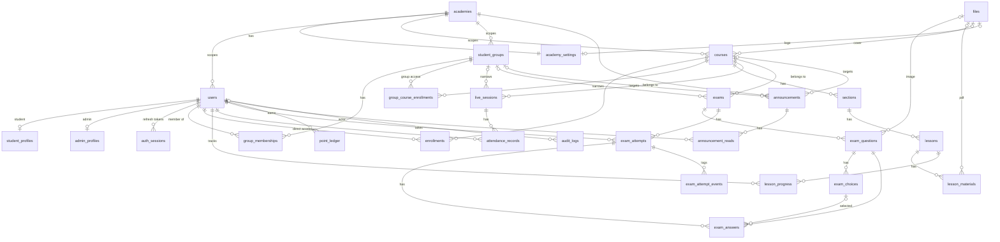
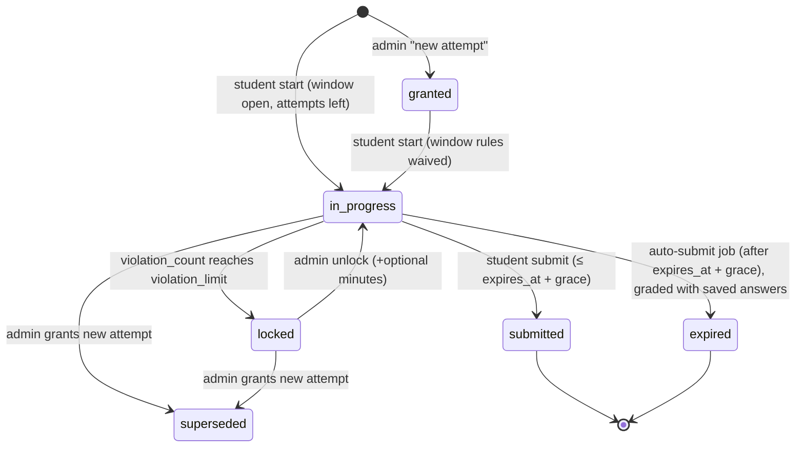

# Talent Academy LMS — Architecture (Phase 0)

Status: **Draft for approval.** No application code has been written yet.
Sources: `refrence/talent-academy-prompt-v2 (2).md` (the spec, called "spec" below) and the prototype in
`refrence/talent-academy-lms-v6.2-comfortable-scale/` (called "prototype"). Where they disagree, the spec wins.
Design system and key screens: [`docs/DESIGN.md`](DESIGN.md).

Contents

1. [System overview](#1-system-overview)
2. [Database schema + ERD](#2-database-schema)
3. [ON DELETE decisions](#3-on-delete-decisions)
4. [Business rules the schema/API rely on](#4-business-rules)
5. [API endpoints](#5-api-endpoints)
6. [Pages and the endpoints they call](#6-pages)
7. [Folder structure](#7-folder-structure)
8. [Background jobs](#8-background-jobs)
9. [Security design](#9-security-design)
10. [Hosting, cost, operations](#10-hosting-cost-operations)
11. [Feature-parity checklist](#11-feature-parity-checklist)
12. [Assumptions](#12-assumptions)
13. [Decisions from the previous round](#13-decisions-from-the-previous-round-confirmed-2026-09-28)

---

## 1. System overview

```
     Cloudflare (added once a domain exists — DNS, SSL, WAF, auth rate-limit rule; see §10, A17)
                    https://<project>.up.railway.app  (for now, no domain)
                                   │
                                   ▼
   ┌──────────────────────── Railway project ─────────────────────────┐
   │  frontend (Next.js standalone, public)                            │
   │    • pages (RSC + client components)                              │
   │    • /api/* route-handler proxy ──private network──┐              │
   │                                                    ▼              │
   │  backend (FastAPI, 1 uvicorn worker + thread pool, PRIVATE only)  │
   │    • REST /api/v1                                                 │
   │    • APScheduler jobs (advisory-locked): auto-submit, file        │
   │      cleanup, orphan sweep, daily backup                          │
   │                         │                                         │
   │  postgres (Railway managed PG 16, PRIVATE only) ◄─┘               │
   └───────────────────────────────────────────────────────────────────┘
                    │ S3 API (backend only holds keys)
                    ▼
        Cloudflare R2: talent-files (private), talent-backups (private)
```

**Key decision: the browser only talks to one origin.** The backend has no public domain. The Next.js
app forwards `/api/*` to the backend over Railway's private network through a small route handler
(`src/app/api/[...path]/route.ts`), which streams bodies and passes the client IP (`CF-Connecting-IP`)
along. Why this setup:
- Cookies are first-party and host-only. No CORS, no cross-subdomain cookie domain, and CSP `connect-src 'self'`.
- The backend and database have no public attack surface. Cloudflare's auth rate-limit rule covers everything.
- One custom domain to set up in Cloudflare instead of two.
- Cost: one extra hop on a private network, which adds about 1–3 ms and a few MB of Next.js memory. Question-image
  uploads (batches of ≤10 WebP files of ≤800 KB each) go through the proxy, which is fine at this size.

The only things fetched from outside the origin are **R2 presigned URLs** for question images and PDFs.
They are short-lived and go straight from the browser to R2. The CSP `img-src`/`frame-src` lists the R2
endpoint explicitly.

---

## 2. Database schema

Conventions:
- PostgreSQL 16. Every timestamp is `timestamptz` in UTC. `created_at`/`updated_at` default to `now()`.
- PKs are `bigint generated always as identity`, except `files.id` and `auth_sessions.id`, which are `uuid` so they can't be guessed.
- Enums are PostgreSQL enum types, created in Alembic migrations.
- Case-insensitive text uses `citext` (email, student_code, group name).
- Arabic search uses `pg_trgm`. Each searchable name has a `*_search` column, normalised in app code:
  أ/إ/آ→ا, ة→ه, ى→ي, diacritics removed, lower-cased. It has a GIN trigram index.
- **Academy scope:** `academy_id` lives on *root* tables (users, student_groups, courses, live_sessions, exams,
  announcements, files, audit_logs). Child tables inherit scope through their parent. All queries on root
  tables go through one helper, `scoped(stmt, Model)`, which adds `Model.academy_id == current_academy_id`.
  For now the ID always comes from the single seeded academy.

### 2.1 Tables

**Academy & settings**

| Table | Columns |
|---|---|
| `academies` | id, name, slug (unique), created_at |
| `academy_settings` | academy_id (PK, FK), display_name, logo_file_id (FK files), primary_color (hex), accent_color (hex), whatsapp_url, point_values (jsonb, validated by Pydantic: `lesson_complete, attendance_manual, attendance_on_time, attendance_late, exam_submit, exam_60_79, exam_80_89, exam_90_99, exam_100`), late_threshold_minutes (10), violation_limit (2), join_open_minutes_before (15), exam_submit_grace_seconds (30), updated_at, updated_by (FK users) |

**Identity**

| Table | Columns |
|---|---|
| `users` | id, academy_id, role (`user_role`: admin, student; teacher/parent added later as enum values), full_name, full_name_search, email (citext, nullable), student_code (citext, nullable), password_hash, must_change_password (bool), is_active, last_login_at, failed_login_count, locked_until, created_at, updated_at. **Unique** (academy_id, student_code); **partial unique** (academy_id, email) where email is not null. **CHECK** `role <> 'student' OR student_code IS NOT NULL` and `role <> 'admin' OR email IS NOT NULL`. |
| `student_profiles` | user_id (PK, FK users), guardian_phone, grade_level (`grade_level`: G10, G11, G12; nullable), student_type (`student_type`: academy, external), subscription_status (`subscription_status`: active, pending, expired, suspended), subscription_expires_at, admin_notes, total_points (int, cached), created_at, updated_at |
| `admin_profiles` | user_id (PK, FK users), title (nullable), created_at |
| `auth_sessions` | id (uuid), user_id, refresh_token_hash, family_id (uuid), expires_at, rotated_at, revoked_at, remember (bool), ip, user_agent, created_at, last_used_at |

`student_code` and `email` sit on `users` because both are login identifiers and need a single-table lookup
plus uniqueness per academy. Everything else that is student-only lives in `student_profiles`. Teacher/parent
roles will add a `teacher_profiles`/`parent_profiles` table plus an enum value, with no restructuring.

**Groups & access**

| Table | Columns |
|---|---|
| `student_groups` | id, academy_id, name (citext), name_search, description, created_at, updated_at. Unique (academy_id, name) |
| `group_memberships` | id, group_id, user_id, added_by (FK users), created_at. Unique (group_id, user_id) |
| `enrollments` | id, user_id, course_id, expires_at, granted_by (FK users), created_at. Unique (user_id, course_id) |
| `group_course_enrollments` | id, group_id, course_id, expires_at, granted_by, created_at. Unique (group_id, course_id) |

**Courses & content**

| Table | Columns |
|---|---|
| `courses` | id, academy_id, title, title_search, subtitle, description, subject, level, accent (`course_accent` token: blue, navy, sky, teal, gold, violet, rose), cover_file_id (FK files), is_published, created_at, updated_at |
| `sections` | id, course_id, title, position. Unique (course_id, position) DEFERRABLE INITIALLY DEFERRED |
| `lessons` | id, section_id, title, description, duration_minutes, recording_url, position, is_preview, created_at, updated_at. Unique (section_id, position) DEFERRABLE |
| `lesson_materials` | id, lesson_id, title, material_type (`material_type`: pdf, link, file), url (nullable), file_id (FK files, nullable), is_downloadable, position. CHECK exactly one of url/file_id |
| `lesson_progress` | id, user_id, lesson_id, completed, completed_at, updated_at. Unique (user_id, lesson_id) |

**Live sessions**

| Table | Columns |
|---|---|
| `live_sessions` | id, academy_id, course_id (NOT NULL), group_id (nullable), title, description, provider (default 'Zoom'), join_url, starts_at, ends_at, recording_url, is_active, attendance_finalized_at, created_by, created_at, updated_at. CHECK ends_at > starts_at |
| `attendance_records` | id, live_session_id, user_id, status (`attendance_status`: present, late, absent, excused), source (`attendance_source`: self_join, admin, finalize), joined_at, note, marked_by (FK users), updated_at. Unique (live_session_id, user_id). "غير محدد" means no row. |

**Exams**

| Table | Columns |
|---|---|
| `exams` | id, academy_id, course_id (NOT NULL), group_id (nullable), title, description, exam_mode (`exam_mode`: full, answer_sheet), duration_minutes, passing_score, max_attempts, starts_at, ends_at, is_published, published_at, created_by, created_at, updated_at |
| `exam_questions` | id, exam_id, question_type (`question_type`: image_mcq, text_mcq, bubble), position, prompt_text, image_file_id (FK files), topic, difficulty (`difficulty`: easy, medium, hard), points. Unique (exam_id, position) DEFERRABLE |
| `exam_choices` | id, question_id, label (`choice_label`: A, B, C, D), text, position, is_correct. Unique (question_id, label). **Partial unique** (question_id) WHERE is_correct, so the DB allows at most one correct choice |
| `exam_attempts` | id, exam_id, user_id, attempt_no, status (`attempt_status`: granted, in_progress, locked, submitted, expired, superseded), started_at, expires_at, submitted_at, submit_source (`submit_source`: student, auto), violation_count, last_violation_at, locked_at, lock_reason, extra_minutes, score_points, total_points, percentage (int), passed, superseded_by_id (FK self), granted_by (FK users), granted_reason, created_at. **Partial unique** (exam_id, user_id) WHERE status IN (granted, in_progress, locked), so there is only ever one open attempt |
| `exam_answers` | id, attempt_id, question_id, choice_id (nullable), client_seq (bigint), is_correct, awarded_points, answered_at. Unique (attempt_id, question_id) |
| `exam_attempt_events` | id, attempt_id, event_type (`attempt_event`: started, resumed, violation, locked, unlocked, extra_time, new_attempt, superseded, submitted, expired), detail, actor_id (FK users), ip, created_at |

`expires_at` is **stored**. It is set on start and changed only by admin actions, so the auto-submit job is a
plain indexed query. Future mock tests (timed parts, passages, grid-ins, scaled scores) will add an
`exam_parts` table (exam_id, title, duration, position) and a nullable `exam_questions.part_id`, plus new
`question_type` values. The current tables don't need to change for that.

**Points, notifications, files, audit, jobs**

| Table | Columns |
|---|---|
| `point_ledger` | id, user_id, **course_id** (FK courses, nullable — set at insert time from the source: lesson→section→course, attendance→live_session.course_id, exam→exam.course_id; becomes null only if that course is later deleted, see §3), event_key, source_type (`point_source`: lesson, attendance, exam), source_id, points, description, created_at, updated_at. Unique (user_id, event_key) |
| `announcements` | id, academy_id, title, body, target_type (`announcement_target`: all, course, group), course_id, group_id, is_active, created_by, created_at, updated_at. CHECK target consistency |
| `announcement_reads` | id, announcement_id, user_id, read_at. Unique (announcement_id, user_id) |
| `files` | id (uuid), academy_id, bucket, storage_key (unique, random), purpose (`file_purpose`: question_image, material_pdf, course_cover, logo), content_type, size_bytes, original_name, uploaded_by, created_at |
| `pending_file_deletions` | id, file_id (**no FK**, because the file row may already be gone), bucket, storage_key, reason, attempts, last_error, next_attempt_at, created_at |
| `audit_logs` | id, academy_id, actor_id, actor_label (name snapshot), action, entity_type, entity_id, summary (jsonb), ip, created_at |
| `job_runs` | id, job_name, started_at, finished_at, status (ok/failed/skipped), detail. Used for "last backup" in Settings |

Admin accounts (Q8) need no extra table — `admin_profiles` already exists 1:1 with `users` for exactly this
purpose. `/admin/admins` is CRUD over `users WHERE role='admin'` + `admin_profiles`, the same shape as the
student endpoints. A `can_deactivate_self = false` rule on the service stops the last admin from being
disabled by mistake.

**File-deletion triggers.** Tables that reference `files` (`lesson_materials.file_id`,
`exam_questions.image_file_id`, `courses.cover_file_id`, `academy_settings.logo_file_id`) have an
`AFTER DELETE` trigger, plus `AFTER UPDATE OF <col>` for replacements. The trigger inserts the old file into
`pending_file_deletions`. Because triggers also fire on **cascaded** deletes, deleting a course queues every
PDF under it without extra service code, in the same transaction. The triggers are created in an Alembic
migration.

### 2.2 Indexes (beyond PKs/uniques)

Every FK column is indexed. Also:
- `users (academy_id, role, is_active)`, GIN trgm on `users.full_name_search`, trgm on `users.student_code`
- `student_profiles (grade_level)`, `(student_type, subscription_status)`, `(total_points DESC)`
- `enrollments (course_id)`, `group_course_enrollments (course_id)`, `group_memberships (user_id)`
- `lesson_progress (user_id, completed)`
- `live_sessions (course_id, starts_at)`, `(starts_at)`, `(group_id)`
- `attendance_records (user_id, live_session_id)`, `(live_session_id, status)`
- `exams (course_id, is_published)`, `(starts_at)`, `(ends_at)`
- `exam_questions (exam_id, position)`
- `exam_attempts (user_id, exam_id)`, `(exam_id, status)`, `(status, expires_at)` for the auto-submit job
- `exam_attempt_events (attempt_id, created_at)`
- `point_ledger (user_id, created_at DESC)`, `(source_type, source_id)`, `(course_id, user_id)` for per-course leaderboards
- `announcements (academy_id, is_active, created_at DESC)`
- `pending_file_deletions (next_attempt_at)`, `audit_logs (entity_type, entity_id)`, `audit_logs (created_at DESC)`

### 2.3 ERD



---

## 3. ON DELETE decisions

Guiding rule: rows that exist only because of a parent get **CASCADE**. Actor/"who did it" references get
**SET NULL**, so history survives. Links whose silent loss would **widen access** or **orphan business data**
get **RESTRICT**, and the service layer decides what to do first.

| FK | ON DELETE | Reasoning |
|---|---|---|
| academy_settings.academy_id | CASCADE | Settings have no meaning without the academy |
| users/courses/student_groups/live_sessions/exams/announcements/files/audit_logs .academy_id | RESTRICT | An academy is never deleted by the app. RESTRICT prevents an accidental wipe |
| academy_settings.logo_file_id, courses.cover_file_id | SET NULL | Losing a cosmetic image must not delete the course/settings (triggers queue the R2 object) |
| academy_settings.updated_by | SET NULL | Actor reference |
| student_profiles.user_id, admin_profiles.user_id | CASCADE | 1:1 extension of the user |
| auth_sessions.user_id | CASCADE | Deleting a user logs them out everywhere |
| group_memberships.group_id / .user_id | CASCADE / CASCADE | Spec: deleting a group removes memberships. Deleting a student removes theirs |
| group_memberships.added_by, enrollments.granted_by, group_course_enrollments.granted_by | SET NULL | Actor reference |
| enrollments.user_id / .course_id | CASCADE / CASCADE | Access is meaningless without either side (spec: delete student / delete course) |
| group_course_enrollments.group_id / .course_id | CASCADE / CASCADE | Spec: delete group removes "group course access". Delete course removes enrollments |
| sections.course_id, lessons.section_id, lesson_materials.lesson_id | CASCADE | Content tree (spec: delete course removes sections, lessons, materials) |
| lesson_materials.file_id | RESTRICT | The file row is removed only by the cleanup job after the material is gone. RESTRICT catches bugs that would leave a material with a dangling file |
| lesson_progress.user_id / .lesson_id | CASCADE / CASCADE | Spec: delete student/course removes progress |
| live_sessions.course_id | **RESTRICT** | Spec: deleting a course is blocked while it has sessions, unless the admin confirms. The service then deletes them explicitly, then the course. Their attendance points stay with the students (Q7) |
| live_sessions.group_id | **RESTRICT** | SET NULL would silently open a group-only session to the whole course. Group delete is blocked while sessions/exams narrow to it — confirmed policy (Q6) |
| live_sessions.created_by | SET NULL | Actor |
| attendance_records.live_session_id / .user_id | CASCADE / CASCADE | Attendance belongs to the session and the student. Deleting it does **not** touch `point_ledger` (Q7) — the student keeps points already earned |
| attendance_records.marked_by | SET NULL | Actor |
| exams.course_id | **RESTRICT** | Same reason as live_sessions.course_id. Unlike live sessions, deleting an exam **does** remove its point-ledger entries (spec §12, unchanged) |
| exams.group_id | **RESTRICT** | Same reason as live_sessions.group_id — confirmed policy (Q6) |
| exams.created_by | SET NULL | Actor |
| exam_questions.exam_id, exam_choices.question_id | CASCADE | Exam content tree |
| exam_questions.image_file_id | RESTRICT | Same reason as lesson_materials.file_id |
| exam_attempts.exam_id / .user_id | CASCADE / CASCADE | Spec: delete exam removes attempts. Delete student removes theirs |
| exam_attempts.superseded_by_id | SET NULL | Keeps the old attempt if the replacement is removed |
| exam_attempts.granted_by | SET NULL | Actor |
| exam_answers.attempt_id / .question_id | CASCADE / CASCADE | Answers belong to the attempt. Question deletes are blocked once attempts exist anyway (§4.5) |
| exam_answers.choice_id | SET NULL | Defensive: a removed choice turns into "unanswered", not a failed delete |
| exam_attempt_events.attempt_id | CASCADE | Log belongs to the attempt |
| exam_attempt_events.actor_id | SET NULL | Actor |
| point_ledger.user_id | CASCADE | Spec: delete student removes points |
| point_ledger.course_id | SET NULL | Q7 keeps lesson/attendance point rows after their course is deleted (history survives), so this can't be RESTRICT or CASCADE. A null `course_id` still has `description` and shows in the student's point history; it just drops out of that course's now-gone leaderboard |
| point_ledger.source_id | *(no FK, polymorphic)* | For exam sources only: cleaned by the service with `(source_type='exam', source_id)` when an exam is deleted, then `total_points` is recalculated in the same transaction. Lesson/attendance sources are **not** cleaned on delete (Q7) |
| announcements.course_id / .group_id | CASCADE / CASCADE | An announcement aimed only at a deleted course/group has no audience. Keeping it with a NULL target would widen it to "all" |
| announcements.created_by | SET NULL | Actor |
| announcement_reads.announcement_id / .user_id | CASCADE / CASCADE | Read state is a pure join row |
| files.uploaded_by | SET NULL | Actor |
| audit_logs.actor_id | SET NULL | Audit history must outlive the actor. `actor_label` keeps the name |

**Delete flows** (each runs in one transaction and writes an `audit_logs` row):
- **Student:** `DELETE users` cascades to profile, sessions, memberships, enrollments, progress, attendance,
  attempts→answers/events, points and reads. The student code is free again immediately.
  `GET …/delete-preview` returns the counts for the confirmation dialog first.
- **Exam:** delete `point_ledger` where `source_type='exam' AND source_id=:id`, recalculate `total_points` for
  those users, then `DELETE exams` (cascade). Triggers queue the question images.
- **Live session:** `DELETE live_sessions` (cascade to attendance_records). **Points are left as-is** (Q7):
  a student who already earned attendance points for that session keeps them, so a schedule cleanup never
  silently docks points a student has genuinely earned. Only the attendance/progress *records* are removed.
- **Lesson:** `DELETE lessons` (cascade to materials, lesson_progress). Same Q7 rule: `point_ledger` rows for
  that lesson are left alone.
- **Course:** if exams/sessions exist and `cascade=false`, return 409 with the counts. With `cascade=true`, run
  the exam delete flow (removes exam points) and the live-session delete flow (keeps attendance points) for
  each, then `DELETE courses` (cascade, which also removes lesson_progress but not point_ledger). Triggers
  queue the PDFs/cover.
- **Group:** 409 `GROUP_IN_USE` if any exam/session is narrowed to the group (response lists them by id/title
  so the admin can retarget or delete those first), otherwise `DELETE` (cascade to memberships and
  group_course_enrollments only — spec §12: "students stay").

---

## 4. Business rules

### 4.1 Course access
A student can access course C when **all** of these hold:
1. `users.is_active`, role = student.
2. Subscription gate: `student_type = academy`, **or** (`subscription_status = active` and
   (`subscription_expires_at` is null or in the future)).
3. There is a direct enrollment, or a membership in a group with a group enrollment, for C, and that grant's
   `expires_at` is null or in the future.
4. `courses.is_published`.

This lives in one SQL-producing function, `accessible_course_ids(user)` (a UNION of the two grants), used by
every student endpoint. External students who fail rule 2 can log in, but every content endpoint returns an
empty list with `access_blocked: {reason: "subscription_expired" | "subscription_pending" | "subscription_suspended"}`,
and the UI shows an Arabic message plus the WhatsApp contact button.

**Audience of a session/exam:** the students with access to its course, intersected with the group's members
when `group_id` is set.

### 4.2 Points (ledger)
`award(user, event_key, source_type, source_id, points, description)` does an upsert on
`(user_id, event_key)`, adds the delta to `student_profiles.total_points` in the **same transaction**, and
removes the row when points become 0. Point values are read from `academy_settings.point_values` at the moment
of the event. Changing settings later does not rewrite history.

| event_key | Rule |
|---|---|
| `lesson:{lesson_id}` | lesson_complete (3) when completed. 0 when un-completed |
| `attendance:{session_id}` | self-join on time → attendance_on_time (7). Self-join late → attendance_late (2). Admin sets present → 7 if `joined_at` exists, else attendance_manual (5). Admin sets late → 2. absent/excused/unmarked → 0 |
| `exam:{exam_id}` | exam_submit (5) + bonus from the **best** percentage among the student's submitted/expired (not superseded) attempts: 60–79 → 5, 80–89 → 10, 90–99 → 15, 100 → 20 |

**Leaderboard scope is per course, not academy-wide** (Q9b). `student_profiles.total_points` stays as the
academy-wide total (shown on the profile page and used for `/admin/overview`), but ranking is always asked
"rank in course X":

```sql
-- points_in_course(course_id) — the query behind /me/leaderboard and /admin/leaderboard
SELECT u.id AS student_id, COALESCE(SUM(pl.points), 0) AS points
FROM users u
JOIN <students with access to :course_id, via accessible_course_ids reversed>  -- direct + group grants
LEFT JOIN point_ledger pl ON pl.user_id = u.id AND pl.course_id = :course_id
WHERE u.role = 'student' AND u.is_active
GROUP BY u.id
ORDER BY points DESC, u.id ASC
```

Rank is tie-aware ("competition ranking": 1, 2, 2, 4) among **active students with access to that course**,
computed as `1 + count(students in that course with more course points)`. The `LEFT JOIN` means a student who
has never earned a point in that course still gets a row (0 points) instead of being omitted, so the
leaderboard always lists every eligible student. The index on `point_ledger (course_id, user_id)` keeps the
join to an index range scan rather than a full-table aggregate.

### 4.3 Live-session join
`POST /me/live-sessions/{id}/join` checks audience membership, `is_active`, and
`starts_at − join_open_minutes_before ≤ now ≤ ends_at`. It then upserts attendance: `present` if
`now ≤ starts_at + late_threshold_minutes`, else `late`. An existing admin-set `excused`/`present` is never
downgraded. It awards points and returns `join_url`. List endpoints **never** include `join_url`.

### 4.4 Exam attempt lifecycle



- **Start** creates the attempt with `expires_at = min(now + duration, exam.ends_at)` and returns questions
  with 15-minute signed image URLs, plus saved answers. If an open attempt exists, it resumes it (same
  payload). Questions and images are **never** returned without an active attempt, and `is_correct` is
  never returned to students.
- **Autosave** (`PUT …/answers`) upserts answers. Each save carries a `client_seq`, and a save older than the
  stored one is ignored, so a slow network can't overwrite newer answers. It is rejected when locked or past
  `expires_at + grace`.
- **Violation:** ignored if < 3 s since the last one, or if the client says it was offline (network loss is
  not a violation). It increments the counter and logs the event. When the count reaches `violation_limit`
  (2), status becomes locked. Locked attempts cannot autosave or submit.
- **Submit** is idempotent. A repeated submit of an already-submitted attempt returns the same result with
  200. After `expires_at + grace` it returns 409 `ATTEMPT_EXPIRED`, and the job will grade it from saved
  answers. Grading happens server-side at submit time. Autosave does not compute correctness.
- **Admin actions:** unlock (counter reset to 0, and if expired, `expires_at = now + remaining-or-extra`),
  extra time (`expires_at = max(now, expires_at) + n`), new attempt (open attempt → superseded; a `granted`
  attempt is created that bypasses max_attempts and the exam window; its timer starts when the student
  presses Start). Each writes an event with the actor.
- `attempts_used` counts submitted + expired attempts, excluding superseded ones.

### 4.5 Exam editing rules
- Adding/deleting/reordering questions, changing correct answers, and changing points are **blocked once any
  attempt exists**, as in the prototype for images and the answer key. Topic/difficulty/text edits are always allowed.
- Publish requires ≥1 question and exactly one correct choice per question. Otherwise 409 lists the question numbers.
- Answer key parser: `BCAD…`, `B C A D`, `1-B 2-C`, `1)B`, `1.B`, `1:B`, commas/newlines. Numbered keys must
  run consecutively from 1. Allowed letters are always A–D (Q4: 4 choices only, no 5-choice mode). With existing questions,
  the key count must equal the question count, and it updates correct choices without deleting anything.
  With no questions (answer-sheet mode), it creates the bubbles. `points_per_question` is optional (blank
  keeps the current points). `publish` is optional (default true, matching the prototype).

---

## 5. API endpoints

Base path `/api/v1`. JSON everywhere except uploads (multipart) and `.xlsx` downloads.
**P** = paginated: `?page=1&page_size=25` (max 100) → `{items, total, page, page_size}`.
Errors: `{"error": {"code": "ATTEMPT_LOCKED", "message": "<Arabic>", "details": {...}}}` with the proper
HTTP status. The frontend shows `message` and branches on `code`.
Roles: **pub** = no auth, **any** = logged-in user, **S** = student, **A** = admin. Every non-pub route checks
role, and every student route that takes an ID checks **ownership/access** (404, not 403, so the endpoint
doesn't reveal what exists).
Unsafe methods require the `X-CSRF-Token` header (§9).

### 5.1 Auth & public

| Method | Path | Role | Request → Response |
|---|---|---|---|
| GET | `/health` | pub | → `{status, db}` (used by the Railway health check) |
| GET | `/public/branding` | pub | → `{display_name, logo_url, primary_color, accent_color, whatsapp_url}` (cached 5 min) |
| GET | `/public/logo/{file_id}` | pub | → image bytes, `Cache-Control: public, max-age=31536000, immutable` (served through the backend so no public bucket is needed) |
| POST | `/auth/login` | pub | `{identifier, password, remember}` → sets cookies, returns `{user: Me, must_change_password}`. Rate limited |
| POST | `/auth/refresh` | pub (refresh cookie) | → rotates the refresh token, new access cookie. Reuse of an old token revokes the whole family |
| POST | `/auth/logout` | any | → revokes the session, clears cookies |
| GET | `/auth/me` | any | → `Me {id, role, full_name, student_code, email, grade_level, student_type, must_change_password}` |
| POST | `/auth/change-password` | any | `{current_password, new_password}` → `LoginResponse`. Optional/self-service (A28) — clears must_change_password and revokes other devices' sessions |

### 5.2 Student (`/me`) — all role S

| Method | Path | Request → Response |
|---|---|---|
| GET | `/me/dashboard` | → `{student, access_blocked?, courses: CourseCard[], next_session?, next_exam?, attendance: {total,present,absent,late,excused,rate}, points: {total, monthly}, course_ranks: [{course_id, course_title, rank, points}], unread_notifications, recent_results: Result[3]}`. **One request**. `course_ranks` replaces the old single academy-wide rank (Q9b) — one row per enrolled course, computed with the per-course query in §4.2 |
| GET | `/me/profile` | → student profile (read-only fields + groups) |
| GET | `/me/courses` | → `CourseCard[] {id,title,subtitle,subject,level,accent,cover_url,progress,lesson_count,completed_count}` |
| GET | `/me/courses/{id}` | → `{course, progress, sections: [{id,title,lessons:[{id,title,duration,completed,is_preview,has_recording,materials_count}]}]}` |
| GET | `/me/lessons` | → recorded lessons grouped by course: `[{course, lessons:[…]}]` |
| GET | `/me/lessons/{id}` | → `{lesson, course_id, recording: {url, embed_url?, kind: youtube/drive/zoom/other}, materials[], prev_id, next_id, completed}` |
| PUT | `/me/lessons/{id}/progress` | `{completed}` → `{completed, points_awarded}` |
| GET | `/me/materials/{id}/download` | → 302 to a 5-minute R2 signed URL (file materials, access checked) |
| GET | `/me/live-sessions` | `?status=upcoming|live|ended` **P** → `LiveSessionCard[]` (**no join_url**) with `can_join`, `join_opens_at`, `my_attendance` |
| POST | `/me/live-sessions/{id}/join` | → `{join_url, attendance_status}`. 409 `JOIN_NOT_OPEN` / 410 `SESSION_ENDED` |
| GET | `/me/exams` | → `StudentExamCard[] {id,title,course_title,group_name,status,duration,question_count,total_points,passing_score,max_attempts,attempts_used,best_score,latest:{percentage,score_points,total_points,submitted_at,passed}?, open_attempt_status?}` |
| GET | `/me/exams/{id}` | → pre-start info (same card + rules text + exam_mode). No questions |
| POST | `/me/exams/{id}/start` | → `AttemptPayload {attempt_id, status, expires_at, server_now, violation_count, violation_limit, questions:[{id,position,type,prompt_text?,image_url?,topic,difficulty,points,choices:[{id,label,text?}]}], saved_answers:{question_id: choice_id}}`. Starts or resumes |
| GET | `/me/attempts/{id}` | → `AttemptPayload` (resume after refresh, re-sign image URLs) |
| PUT | `/me/attempts/{id}/answers` | `{client_seq, answers:[{question_id, choice_id|null}]}` → `{saved, server_now, expires_at}`. 423 when locked |
| POST | `/me/attempts/{id}/events` | `{type: page_hidden|window_blur|fullscreen_exit, was_offline}` → `{violation_count, locked, message}` |
| POST | `/me/attempts/{id}/submit` | `{client_seq, answers[]}` → `Result {attempt_id, exam_title, score_points, total_points, percentage, passed, submitted_at, points_awarded}` (idempotent) |
| GET | `/me/results` | **P** → `Result[]` |
| GET | `/me/points` | → `{total, monthly, course_ranks: [{course_id, course_title, rank, points}], history: PointEvent[] (P)}` |
| GET | `/me/leaderboard` | **`?course_id=` (required)** `&limit=50` → `{course_id, course_title, rows: LeaderRow[] {rank, student_id, display_name, points, is_me}, me: LeaderRow}`. `display_name` only — **no `student_code`** in this response (Q9: leaderboard privacy) |
| GET | `/me/calendar` | `?from&to` (≤ 62 days) → `[{id, type: live|exam, title, starts_at, ends_at, course_title, href}]` |
| GET | `/me/notifications` | **P** → `[{id,title,body,target_type,course_title?,group_name?,created_at,is_read}]` |
| POST | `/me/notifications/{id}/read` | → 204 |
| POST | `/me/notifications/read-all` | → 204 |

### 5.3 Admin (`/admin`) — all role A

**Overview**

| Method | Path | Request → Response |
|---|---|---|
| GET | `/admin/overview` | → `{students: {total, active, by_type, by_grade}, courses, exams: {total, published}, upcoming_sessions: [5], attendance_rate, exam_average, recent_students: [5], recent_exam_activity: [10], locked_attempts_count}`. **One request** |

**Students**

| Method | Path | Request → Response |
|---|---|---|
| GET | `/admin/students` | `?q&grade&type&subscription&group_id&course_id&active&sort` **P** → `StudentRow[] {id, full_name, student_code, grade_level, student_type, effective_subscription, guardian_phone, is_active, last_login_at, groups_count, courses_count, total_points}` |
| POST | `/admin/students` | `StudentCreate {student_code, full_name, email?, guardian_phone?, grade_level?, student_type, subscription_status, subscription_expires_at?, admin_notes?, password?, course_ids?, group_ids?}` → `{student: StudentDetail, generated_password?}` |
| GET | `/admin/students/{id}` | → `StudentDetail` (row + enrollments with source & expiry, groups, notes) |
| PATCH | `/admin/students/{id}` | partial `StudentCreate` (not password) → `StudentDetail` |
| POST | `/admin/students/{id}/reset-password` | `{password?}` (blank = generate) → `{generated_password?}`. Sets must_change_password (informational, A28) and revokes sessions |
| GET | `/admin/students/{id}/delete-preview` | → counts `{enrollments, groups, attempts, attendance, points, progress}` |
| DELETE | `/admin/students/{id}` | → 204 (audited) |
| POST | `/admin/students/bulk` | `{student_ids[], action: activate|deactivate|add_to_group|remove_from_group|enroll|unenroll|delete, group_id?, course_id?, expires_at?}` → `{affected}` |
| PUT | `/admin/students/{id}/enrollments/{course_id}` | `{expires_at?}` → enrollment |
| DELETE | `/admin/students/{id}/enrollments/{course_id}` | → 204 |
| GET | `/admin/students/import/template.xlsx` | → xlsx template (bilingual headers) |
| POST | `/admin/students/import/preview` | multipart `.xlsx`/`.csv` (≤ 2 MB, ≤ 2,000 rows) → `{rows:[{row_no, data, errors[], warnings[]}], valid_count, error_count}`. Nothing is saved |
| POST | `/admin/students/import/commit` | `{rows: validated data[]}` → `{created:[{row_no, id, student_code, full_name, generated_password?}], failed:[{row_no, errors}]}`. Re-validates. All or nothing per row |
| POST | `/admin/students/credentials.xlsx` | `{rows:[{student_code, full_name, password}]}` → xlsx. The server stores nothing; the passwords only live in the admin's browser memory |
| GET | `/admin/students/export.xlsx` | same filters as the list → xlsx |

**Groups**

| Method | Path | Request → Response |
|---|---|---|
| GET | `/admin/groups` | `?q` **P** → `[{id,name,description,members_count,courses:[{id,title,expires_at}]}]` |
| POST / PATCH / DELETE | `/admin/groups`, `/admin/groups/{id}` | `{name, description}`. DELETE returns 409 `GROUP_IN_USE` with the sessions/exams |
| GET | `/admin/groups/{id}` | → group + courses |
| GET | `/admin/groups/{id}/members` | `?q` **P** → `StudentRow[]` |
| POST | `/admin/groups/{id}/members` | `{student_ids[]}` → `{added}` |
| DELETE | `/admin/groups/{id}/members/{student_id}` | → 204 |
| POST | `/admin/groups/{id}/members/by-grade` | `{grade_level, dry_run}` → `{would_add | added}` (explicit action, confirmed with the count) |
| PUT / DELETE | `/admin/groups/{id}/courses/{course_id}` | `{expires_at?}` |

**Courses & content**

| Method | Path | Request → Response |
|---|---|---|
| GET | `/admin/courses` | `?q&subject&published` **P** → `[{id,title,subject,level,accent,is_published,lesson_count,student_count}]` (set-based counts) |
| POST | `/admin/courses` | `CourseIn` → `CourseAdminDetail` |
| GET | `/admin/courses/{id}` | → course + full section/lesson/material tree |
| PATCH | `/admin/courses/{id}` | partial `CourseIn` (incl. `cover_file_id`) |
| GET | `/admin/courses/{id}/delete-preview` | → `{sections, lessons, materials, enrollments, exams, live_sessions, students_with_progress}` |
| DELETE | `/admin/courses/{id}` | `?cascade=true|false` → 204 or 409 `COURSE_HAS_DEPENDENTS` |
| GET | `/admin/courses/{id}/students` | **P** → students with access + source (direct/group name) + progress |
| POST | `/admin/courses/{id}/sections` | `{title}` |
| PATCH / DELETE | `/admin/sections/{id}` | `{title}` |
| PUT | `/admin/courses/{id}/sections/order` | `{ids[]}` |
| POST | `/admin/sections/{id}/lessons` | `{title, description, duration_minutes, recording_url?, is_preview}` |
| PATCH / DELETE | `/admin/lessons/{id}` | partial lesson |
| PUT | `/admin/sections/{id}/lessons/order` | `{ids[]}` |
| POST | `/admin/lessons/{id}/materials` | `{title, material_type, url? , file_id?, is_downloadable}` |
| PATCH / DELETE | `/admin/materials/{id}` | partial material |
| PUT | `/admin/lessons/{id}/materials/order` | `{ids[]}` |
| POST | `/admin/files` | multipart `{file, purpose: material_pdf|course_cover|logo}` → `{id, content_type, size_bytes, original_name}` (MIME sniffed + size checked) |
| GET | `/admin/files/{id}/url` | → `{url, expires_at}` |

All content mutations return the updated course tree, so the builder re-renders from a single response
(prototype behaviour).

**Live sessions & attendance**

| Method | Path | Request → Response |
|---|---|---|
| GET | `/admin/live-sessions` | `?course_id&group_id&status&from&to` **P** → sessions (incl. join_url, audience_count, attendance summary) |
| POST / PATCH / DELETE | `/admin/live-sessions`, `/{id}` | `{title, description, course_id, group_id?, provider, join_url, starts_at, ends_at, recording_url?, is_active}` |
| GET | `/admin/live-sessions/{id}/attendance` | → `{session, counts:{present,late,absent,excused,unmarked}, students:[{student_id, full_name, student_code, grade_level, status, source, joined_at, note}]}` |
| PUT | `/admin/live-sessions/{id}/attendance/{student_id}` | `{status: present|late|absent|excused|unmarked, note?}` → row + counts (**one-tap update**) |
| PUT | `/admin/live-sessions/{id}/attendance` | `{records[]}` bulk → full sheet |
| POST | `/admin/live-sessions/{id}/attendance/finalize` | → full sheet (unmarked → absent, sets attendance_finalized_at) |
| GET | `/admin/live-sessions/{id}/attendance.xlsx` | → xlsx |

**Exams**

| Method | Path | Request → Response |
|---|---|---|
| GET | `/admin/exams` | `?q&course_id&state=draft|upcoming|available|ended` **P** → `[{id,title,course_title,group_name,exam_mode,state,question_count,total_points,attempts_count,average_score,locked_count,starts_at,ends_at}]` |
| POST | `/admin/exams` | `ExamIn {title, description, course_id, group_id?, exam_mode, duration_minutes, passing_score, max_attempts, starts_at?, ends_at?}` (always created as draft; always 4 choices, A–D — Q4) |
| GET | `/admin/exams/{id}` | → exam + questions (admin signed image URLs, `is_correct` included) + `has_attempts` |
| PATCH | `/admin/exams/{id}` | partial `ExamIn` |
| POST | `/admin/exams/{id}/publish` · `/unpublish` | → exam, or 409 `EXAM_NOT_READY {question_numbers[]}` |
| GET | `/admin/exams/{id}/delete-preview` · DELETE `/admin/exams/{id}` | counts / 204 |
| POST | `/admin/exams/{id}/question-images` | multipart `files[] (≤10 per request, ≤800 KB each, webp/png/jpeg sniffed)`, `topic, difficulty, points` → exam. Order = natural sort of file names, appended after the last position |
| POST | `/admin/exams/{id}/questions` | `{question_type: text_mcq, prompt_text, choices:[{label,text}], correct_label, topic, difficulty, points}` |
| PATCH | `/admin/questions/{id}` | `{topic?, difficulty?, points?, prompt_text?, choices?, correct_label?}` (points/choices/correct blocked once attempts exist) |
| DELETE | `/admin/questions/{id}` | → exam (blocked once attempts exist) |
| PUT | `/admin/exams/{id}/questions/order` | `{ids[]}` |
| POST | `/admin/exams/{id}/answer-key/preview` | `{answers}` → `{parsed:[letters], count, question_count, errors[]}` |
| POST | `/admin/exams/{id}/answer-key` | `{answers, points_per_question?, publish=true}` → exam |
| GET | `/admin/exams/{id}/results` | `?status=all|submitted|not_taken|locked` **P** → every eligible student: `{student, status, best, latest:{percentage, score_points, total_points, passed, submitted_at}, attempts_used}` |
| GET | `/admin/exams/{id}/results.xlsx` | → xlsx |
| GET | `/admin/exams/{id}/attempts` | `?status` **P** → `[{attempt_id, student, attempt_no, status, violation_count, started_at, expires_at, submitted_at, answered_count, question_count, percentage?}]` |
| GET | `/admin/attempts/{id}` | → attempt + events timeline + per-question answers (correct/incorrect) |
| POST | `/admin/attempts/{id}/unlock` | `{reason, extra_minutes}` |
| POST | `/admin/attempts/{id}/extra-time` | `{reason, minutes (1–360)}` |
| POST | `/admin/attempts/{id}/new-attempt` | `{reason, extra_minutes}` |

**Points, reports, announcements, settings, audit**

| Method | Path | Request → Response |
|---|---|---|
| GET | `/admin/leaderboard` | **`?course_id=` (required)** **P** → `LeaderRow[] {rank, student_id, full_name, student_code, points}`. Admin view keeps `student_code` (only the student-facing `/me/leaderboard` hides it — Q9) |
| GET | `/admin/students/{id}/points` | **P** → `PointEvent[] {..., course_id, course_title}` |
| GET | `/admin/reports/students` | `?q&grade&type&subscription&group_id&course_id&sort` **P** → `[{student, overall_progress, courses_count, completed_lessons, total_lessons, exams_taken, exam_average, attendance:{present,late,absent,excused,rate}, total_points, last_login_at}]`, computed with set-based SQL aggregates (the prototype built a full report per student, N+1) |
| GET | `/admin/reports/students.xlsx` | same filters → xlsx |
| GET | `/admin/reports/students/{id}` | → full report `{student, subscription, groups, courses:[progress + course rank/points], attendance:{summary, records[]}, exams:[per exam: best, latest, attempts], points:{total, recent}, last_login_at, admin_notes, whatsapp_summary_text}` |
| GET | `/admin/reports/students/{id}.xlsx` | → multi-sheet xlsx |
| GET / POST | `/admin/announcements` | **P** / `{title, body, target_type, course_id?, group_id?, is_active}` |
| PATCH / DELETE | `/admin/announcements/{id}` | |
| GET / PATCH | `/admin/settings` | `{display_name, logo_file_id, primary_color, accent_color, whatsapp_url, point_values, late_threshold_minutes, violation_limit, join_open_minutes_before}` (colours are rejected if contrast against white < 4.5:1) → settings + `last_backup` |
| GET | `/admin/audit-logs` | `?entity_type&actor_id` **P** |
| GET | `/admin/admins` | **P** → `[{id, full_name, email, title, is_active, last_login_at, created_at}]` |
| POST | `/admin/admins` | `{full_name, email, title?, password?}` (blank password = generate) → `{admin, generated_password?}` |
| PATCH | `/admin/admins/{id}` | `{full_name?, title?, is_active?}`. 409 `LAST_ADMIN` if this would deactivate the only active admin |
| POST | `/admin/admins/{id}/reset-password` | `{password?}` → `{generated_password?}` |

---

## 6. Pages

Student routes use a bottom nav on mobile and a side rail on desktop. Admin routes use a collapsible sidebar.
All data is fetched with TanStack Query through the typed client in `src/lib/api`.

### 6.1 Public & auth

| Route | Page | Endpoints |
|---|---|---|
| `/` | Branded entry: logo, one line, "تسجيل الدخول" button (redirects to the right home if logged in) | `GET /public/branding` (server) |
| `/login` | Login (code or admin email) | `POST /auth/login` |
| `/change-password` | Optional, self-service password change (A28) — reachable from Profile/the account menu, never forced | `POST /auth/change-password` |
| `/design` | Design-system preview (Phase 1; admin-only in production) | none |

The route guard (`src/proxy.ts`; Next.js 16 renamed `middleware` to `proxy`) reads the access-token cookie. It
redirects anonymous users to `/login`, admins to `/admin`, students to `/dashboard`. It does **not** redirect
based on `must_change_password` — that field is informational only (A28); nothing forces a password change.
This only routes; the backend enforces every permission itself.

### 6.2 Student portal

| Route | Page (Arabic nav label) | Endpoints |
|---|---|---|
| `/dashboard` | الرئيسية | `GET /me/dashboard` |
| `/courses` | الكورسات | `GET /me/courses` |
| `/courses/[id]` | Course page (sections/lessons) | `GET /me/courses/{id}` |
| `/courses/[id]/lessons/[lessonId]` | Lesson player | `GET /me/lessons/{id}`, `PUT …/progress`, `GET /me/materials/{id}/download` |
| `/lessons` | الدروس (recorded lessons by course) | `GET /me/lessons` |
| `/live` | الحصص (Upcoming / Live now / Ended tabs) | `GET /me/live-sessions`, `POST …/join` |
| `/exams` | الامتحانات | `GET /me/exams`, `GET /me/results` (tab) |
| `/exams/[id]` | Pre-start screen | `GET /me/exams/{id}`, `POST /me/exams/{id}/start` |
| `/exams/[id]/take` | Full-screen exam (no shell) | `GET /me/attempts/{id}`, `PUT …/answers`, `POST …/events`, `POST …/submit` |
| `/exams/[id]/result/[attemptId]` | Result screen | from submit response / `GET /me/results` |
| `/points` | النقاط (course selector above the leaderboard, per Q9b) | `GET /me/points`, `GET /me/leaderboard?course_id=` |
| `/calendar` | الجدول (month + agenda) | `GET /me/calendar` |
| `/notifications` | الإشعارات | `GET /me/notifications`, `POST …/read`, `POST …/read-all` |
| `/profile` | الملف الشخصي (+ change password) | `GET /me/profile`, `POST /auth/change-password`, `POST /auth/logout` |

### 6.3 Admin panel

| Route | Page (Arabic nav label) | Endpoints |
|---|---|---|
| `/admin` | نظرة عامة | `GET /admin/overview` |
| `/admin/students` | الطلاب (table + filters + bulk bar; create/edit in drawer) | `GET/POST /admin/students`, `PATCH`, `POST /bulk`, `GET /admin/groups` & `/admin/courses` (filter options) |
| `/admin/students/import` | Excel import wizard (upload → preview → commit → download credentials) | `…/import/template.xlsx`, `…/import/preview`, `…/import/commit`, `…/credentials.xlsx` |
| `/admin/students/[id]` | Student page: info, courses, groups, password reset, delete | `GET/PATCH /admin/students/{id}`, enrollments, group members, `reset-password`, `delete-preview`, `DELETE` |
| `/admin/groups` | المجموعات | `GET/POST/PATCH/DELETE /admin/groups` |
| `/admin/groups/[id]` | Group: members (search-add, add-by-grade), courses | `/admin/groups/{id}`, `/members`, `/members/by-grade`, `/courses/{course_id}` |
| `/admin/courses` | الكورسات | `GET/POST /admin/courses` |
| `/admin/courses/[id]` | Course builder (sections, lessons, materials drawers; access tab) | course tree endpoints, `/admin/files`, `/admin/courses/{id}/students`, delete-preview |
| `/admin/live` | الحصص | `GET/POST/PATCH/DELETE /admin/live-sessions` |
| `/admin/attendance` | الحضور (session picker) | `GET /admin/live-sessions?status=…` |
| `/admin/attendance/[sessionId]` | Attendance sheet (one-tap status) | `…/attendance`, `PUT …/attendance/{student_id}`, `…/finalize`, `.xlsx` |
| `/admin/exams` | الامتحانات | `GET/POST /admin/exams` |
| `/admin/exams/[id]` | Builder: settings, image upload, answer key, questions | exam endpoints, question endpoints, answer-key preview/commit, publish |
| `/admin/exams/[id]/results` | Results (all eligible students) + attempts & security tab | `…/results`, `…/results.xlsx`, `…/attempts`, `/admin/attempts/{id}` + actions |
| `/admin/reports` | التقارير | `GET /admin/reports/students`, `.xlsx` |
| `/admin/reports/[studentId]` | Full student report (+ WhatsApp summary, Excel, print) | `GET /admin/reports/students/{id}`, `.xlsx` |
| `/admin/announcements` | الإعلانات | announcements CRUD |
| `/admin/settings` | الإعدادات (branding, points, thresholds, backups status, **المشرفون** tab, audit log) | `GET/PATCH /admin/settings`, `POST /admin/files`, `GET /admin/audit-logs`, `GET/POST/PATCH /admin/admins`, `POST /admin/admins/{id}/reset-password` |

---

## 7. Folder structure

```
TALENT-LMS/                         (git repo root; refrence/ is git-ignored)
├── backend/
│   ├── Dockerfile                  multi-stage, python:3.12-slim + postgresql-client-16 (for pg_dump)
│   ├── pyproject.toml              uv-managed; ruff + mypy + pytest config
│   ├── alembic.ini
│   ├── alembic/versions/           migrations only (no create_all, no startup ALTERs)
│   ├── app/
│   │   ├── main.py                 app factory, middleware, routers, scheduler start
│   │   ├── core/                   config, security (argon2, jwt, legacy pbkdf2 verify), csrf,
│   │   │                           rate_limit, errors (codes + Arabic messages), logging (JSON), time (Cairo)
│   │   ├── db/                     engine/session, base, academy scope helper, arabic normalise
│   │   ├── models/                 identity, groups, courses, live, exams, points, notifications, files, audit
│   │   ├── schemas/                one module per API module
│   │   ├── services/               access, points, students, groups, courses, lessons, live, attendance,
│   │   │                           exams, answer_key, attempts, grading, reports, announcements,
│   │   │                           settings, files, storage_r2, excel, audit
│   │   ├── api/
│   │   │   ├── deps.py             current_user, require_admin, require_student, db, csrf
│   │   │   └── v1/                 auth, public, me_*, students, groups, courses, lessons, live,
│   │   │                           attendance, exams, attempts, points, reports, announcements, settings
│   │   ├── jobs/                   scheduler (advisory locks), auto_submit, file_cleanup, orphan_sweep, backup
│   │   └── cli/                    create_admin, seed_dev, import_prototype
│   └── tests/                      pytest (real Postgres via docker/testcontainers), factories
├── frontend/
│   ├── Dockerfile                  node:22-alpine, output: "standalone"
│   ├── next.config.ts
│   ├── components.json             shadcn/ui config
│   ├── public/                     logo fallback, favicon
│   └── src/
│       ├── proxy.ts                route guard + CSP nonce + security headers
│       ├── app/
│       │   ├── api/[...path]/route.ts   backend proxy
│       │   ├── (public)/  page.tsx, login/, change-password/
│       │   ├── (student)/ layout.tsx (shell), dashboard/, courses/, lessons/, live/, exams/,
│       │   │              points/, calendar/, notifications/, profile/
│       │   ├── exam/[id]/take/     full-screen exam route (outside the shell)
│       │   ├── admin/     layout.tsx (sidebar), page.tsx, students/, groups/, courses/, live/,
│       │   │              attendance/, exams/, reports/, announcements/, settings/
│       │   └── design/             component preview
│       ├── components/ui/          shadcn primitives, restyled
│       ├── components/             app-level: shells, nav, page-header, data-table, empty/error states,
│       │                           progress-ring, countdown, stat-tile, confirm-dialog, drawer-form
│       ├── features/<domain>/      api hooks (TanStack Query), zod schemas, domain components
│       ├── lib/                    api client (fetch + CSRF + refresh-on-401), query client,
│       │                           format (Africa/Cairo dates, Arabic numerals policy), image compression
│       └── styles/                 globals.css (tokens), fonts
├── docs/
│   ├── ARCHITECTURE.md
│   ├── DESIGN.md
│   └── RESTORE.md                  (Phase 8)
├── docker-compose.dev.yml          postgres + minio (local R2 stand-in) + backend + frontend
├── .env.example
├── .github/workflows/ci.yml        lint, type-check, tests, build (on PRs)
└── README.md                       owner guide (Phase 8)
```

---

## 8. Background jobs

APScheduler (`BackgroundScheduler`) runs inside the backend process. Each job starts with
`SELECT pg_try_advisory_lock(<job id>)` and skips if the lock is taken, so a second replica or an overlapping
run never duplicates work. Each run writes to `job_runs`.

| Job | Schedule | What it does |
|---|---|---|
| `auto_submit` | every 30 s | For attempts with `status = in_progress AND expires_at + grace < now` (batch 100, `FOR UPDATE SKIP LOCKED`): grade from saved answers, status → expired, `submit_source = auto`, event `expired`, exam points. Locked attempts are left alone (Q5) |
| `file_cleanup` | every 5 min | For each due `pending_file_deletions` row: delete the R2 object (404 counts as success), delete the `files` row, delete the queue row. On error: `attempts+1` and exponential backoff (1 min → 6 h), then alert in logs after 10 tries |
| `orphan_sweep` | daily 03:30 Cairo | Finds `files` rows referenced by nothing and older than 24 h (e.g. an upload whose form was abandoned) and queues them |
| `backup` | daily 04:00 Cairo | `pg_dump --format=custom` streamed to `talent-backups/daily/YYYY-MM-DD.dump`. On Fridays it also copies to `weekly/`. Keeps 14 daily + 8 weekly and prunes older ones. Records size and duration |
| `session_prune` | daily | Deletes expired/revoked `auth_sessions` older than 30 days |

The restore procedure (Phase 8, `docs/RESTORE.md`) is tested against a scratch Railway database:
`pg_restore --clean --no-owner`.

---

## 9. Security design

| Topic | Design |
|---|---|
| Passwords | argon2id (`argon2-cffi`, default params). Legacy prototype hashes (`pbkdf2_sha256$…`) are verified and re-hashed to argon2 on successful login. Min 8 characters, and must not equal the student code |
| Tokens | Access JWT (HS256, 15 min, `sub`, `role`, `sid`), refresh token (opaque random, stored hashed, rotated on every use, family revoked on reuse). Cookies are `HttpOnly; Secure; SameSite=Lax; Path=/` (refresh cookie `Path=/api/v1/auth`). Session lengths: see A10 |
| CSRF | Double-submit: a non-HttpOnly `csrf_token` cookie must equal the `X-CSRF-Token` header on POST/PUT/PATCH/DELETE, plus an `Origin` check. SameSite=Lax is a second layer |
| Rate limiting | Login: 5/min per IP+identifier, 20/min per IP. Account lock for 15 min after 10 failures (`users.locked_until`). Autosave: 2/s per attempt. In-process token buckets (single backend instance), plus a Cloudflare rule on `/api/v1/auth/*` |
| RBAC | Router-level dependencies (`require_admin` on the whole `/admin` router, `require_student` on `/me`). Services take the current user and filter by ownership. Tests cover every route for anonymous/student/other-student/admin |
| Exam secrecy | Questions/images only inside an active attempt. `is_correct` never serialised in student schemas (separate Pydantic models). Images have random R2 keys and 15-minute signed URLs |
| Join links | Only in the `POST …/join` response and admin schemas |
| Uploads | MIME sniffed from magic bytes (not the client header). Size limits: question image 800 KB, PDF 20 MB, logo/cover 2 MB. Random keys. `Content-Disposition` is set on signed PDF URLs |
| Input | Pydantic v2 strict models with length limits. Announcement/description bodies are stored as plain text, HTML stripped with `nh3`, rendered as text with line breaks and auto-linked URLs (A7). URL fields accept https only |
| Headers | Frontend proxy.ts: CSP with per-request nonce (`default-src 'self'`; `img-src 'self' data: blob: <r2-endpoint>`; `frame-src youtube-nocookie.com drive.google.com …`), HSTS (preload-ready), X-Frame-Options DENY, X-Content-Type-Options nosniff, Referrer-Policy strict-origin-when-cross-origin, Permissions-Policy. Backend responses carry the same basics |
| Secrets | Railway variables only. `.env.example` committed, `.env` git-ignored. Startup refuses to run in production with default/short secrets |
| Audit | Every delete, password reset, attempt admin action, settings change, and bulk action → `audit_logs` |
| Logs | JSON lines (request id, user id, route, status, duration). Passwords, tokens, and join URLs are never logged |

---

## 10. Hosting, cost, operations

- **Railway:** 3 services, all with auto-deploy on push to `main`. Backend start command:
  `alembic upgrade head && uvicorn app.main:app --host :: --port $PORT --workers 1 --proxy-headers`
  (`::` because Railway's private network is IPv6). Health check path `/api/v1/health`.
- **Domain (Q1: none yet).** The frontend goes live on Railway's own `*.up.railway.app` URL. Cookies,
  `CORS_ORIGINS`, and every "custom domain" step in §16 of the spec (Cloudflare DNS/SSL, the
  `/api/v1/auth/*` rate-limit rule) are simply **skipped for now** — the Railway URL already has HTTPS.
  `.env.example` and the README have a clearly marked `# TODO: custom domain` block: once one exists, point
  Cloudflare at Railway, set `FRONTEND_URL`/`CORS_ORIGINS` to it, and no code changes are needed.
- **Memory targets:** frontend ~120–180 MB (standalone), backend ~120–200 MB (1 worker, 20-thread
  pool, SQLAlchemy pool size 5 + overflow 5), Postgres ~100–250 MB.
- **Rough monthly cost** (Railway Hobby plan, usage-based; verify on railway.com before committing):
  subscription ≈ $5 including $5 of usage. Expected usage for ~500 students is about $5–15/month total.
  R2 stays within the free tier (10 GB storage, free egress). Cloudflare free plan. Set a Railway **usage
  limit** (e.g. $20) so the bill can't run away (documented in the README).
- **Local dev:** `docker compose -f docker-compose.dev.yml up`. Services: Postgres 16, MinIO (S3-compatible
  stand-in for R2), backend with reload, frontend dev server. `make seed` / `uv run python -m app.cli.seed_dev`.
- **CI:** GitHub Actions on PRs runs ruff, mypy, pytest (Postgres service), eslint, tsc, and next build.
- **Prototype data import — deprioritised (Q10).** There are no real students on the prototype yet, so Phase 8
  is a clean launch with a fresh database, not a migration. `app.cli.import_prototype` is kept as an
  **optional, unscheduled** tool in case it's ever needed: reads the Supabase DB via `PROTOTYPE_DATABASE_URL`,
  maps users → users + student_profiles (keeps the PBKDF2 hashes, so passwords keep working), groups,
  courses/sections/lessons/materials (`worksheet/notes/other` → `link`), enrollments, live sessions,
  attendance, exams/questions/choices, attempts/answers/events, and the point ledger (deriving `course_id` per
  row from the source lesson/session/exam). It copies question images from the Supabase public bucket to R2
  with new random keys, recalculates `total_points`, and prints a reconciliation report. Rows with a NULL
  course (legacy SET NULL) are reported, not guessed. It is
  idempotent via a `legacy_id` mapping table, so it can be rerun for the final cutover.

---

## 11. Feature-parity checklist

✅ = carried over as-is · 🔧 = carried over and hardened/changed per spec · ➕ = new (spec) · Phase = build phase.

| # | Prototype feature | New platform | Phase |
|---|---|---|---|
| 1 | Login with Student ID or admin email on one screen | 🔧 cookies, rate limit | 1 |
| 2 | No self-registration; admin creates accounts | ✅ | 2 |
| 3 | Production refuses predictable demo users; INITIAL_ADMIN_* bootstrap | ✅ (via `create_admin` on empty DB) | 1 |
| 4 | Student fields: code, name, email, guardian phone, grade, type, subscription status/expiry, notes, last login | 🔧 email optional | 2 |
| 5 | Student code manual, unique, case-insensitive, editable | ✅ | 2 |
| 6 | Admin password reset (no OTP) | 🔧 + generated passwords (change is optional/self-service, not forced — A28) | 2 |
| 7 | Activate/deactivate; inactive can't log in | ✅ | 2 |
| 8 | External subscription gating (active + not expired) | 🔧 clear Arabic blocked-state message | 2 |
| 9 | Student search + grade filter | 🔧 server-side, paginated, more filters | 2 |
| 10 | Assign/remove direct course with optional expiry | ✅ | 2 |
| 11 | Delete student with all data | 🔧 confirmation summary, code reusable, audit | 2 |
| 12 | Custom groups (unique names), search-add students, add-by-grade (explicit) | ✅ + dry-run count | 2 |
| 13 | Group course access with optional expiry | ✅ | 2 |
| 14 | G10/G11/G12 is metadata only | ✅ | 2 |
| 15 | Bulk Excel/CSV import + password export | ➕ | 2 |
| 16 | Courses: title, subtitle, description, subject, level, accent, published | ✅ + cover image | 3 |
| 17 | Course builder: sections, lessons, materials | ✅ + reorder | 3 |
| 18 | Lesson recording = external URL; YouTube embed | 🔧 + Drive/Zoom handling | 3 |
| 19 | Materials (link / PDF) | 🔧 PDF upload to R2 + signed download | 3 |
| 20 | Mark lesson complete (+3 points), course progress % | ✅ | 3 |
| 21 | Recorded Lessons page grouped by course | ✅ | 3 |
| 22 | Course page + lesson player with prev/next and sidebar | ✅ | 3 |
| 23 | Delete course removes its exams/sessions (prototype did this silently) | 🔧 blocked unless confirmed | 3 |
| 24 | Live sessions CRUD (course required, optional group) | ✅ + recording_url | 4 |
| 25 | Student live list Upcoming/Live/Ended | 🔧 join opens 15 min early | 4 |
| 26 | Join records attendance (present ≤10 min, else late) + points | 🔧 join_url only from join endpoint | 4 |
| 27 | Arabic attendance sheet حاضر/غائب/متأخر/بعذر/غير محدد + notes | 🔧 one-tap per student | 4 |
| 28 | Finalize = unmarked → غائب | ✅ | 4 |
| 29 | Exam fields incl. mode full/answer_sheet, window, attempts, pass % | ✅ (always 4 choices A–D, confirmed — no 5-choice mode) | 5 |
| 30 | Bulk image questions: browser WebP compression, batched upload, natural file order | 🔧 private R2 | 5 |
| 31 | Topic / difficulty / points per question | 🔧 editable per question after upload | 5 |
| 32 | Manual text MCQ and True/False (صح/خطأ) questions | ✅ (True/False = 2-choice text MCQ) | 5 |
| 33 | Quick Answer Key (BCAD… / 1-B 2-C), updates without deleting, creates bubbles in answer-sheet mode, publishes | 🔧 preview step, optional points, publish toggle | 5 |
| 34 | Publish blocked without exactly one correct answer per question | ✅ (also enforced by DB index) | 5 |
| 35 | Images/answer key locked once attempts start | ✅ extended to all scoring edits | 5 |
| 36 | Student exams list with latest grade, points, date, pass, best, attempts | ✅ | 6 |
| 37 | Pre-start screen with rules | ✅ | 6 |
| 38 | Questions withheld until an attempt exists; `is_correct` never sent | ✅ | 6 |
| 39 | Server timer, autosave, resume after refresh, navigator | 🔧 client_seq ordering | 6 |
| 40 | Anti-leave: warning → lock on 2nd; offline ≠ violation; 3 s dedupe | ✅ (limit configurable) | 6 |
| 41 | Admin unlock / extra time / new attempt (old kept) | 🔧 new attempt's timer starts when the student starts | 6 |
| 42 | Attempt event log | ✅ + actor | 6 |
| 43 | Late submit rejected after 30 s grace | ✅ | 6 |
| 44 | Expired attempts finalised only on return | 🔧 auto-submit job | 6 |
| 45 | Auto-graded result screen | ✅ | 6 |
| 46 | Admin results per exam | 🔧 includes students who didn't take it | 6 |
| 47 | Points ledger, idempotent, best-score exam points, attendance updates same entry | ✅ | 7 |
| 48 | Tie-aware leaderboard, monthly points, recent history | 🔧 scoped **per course** instead of academy-wide; names only for students, codes stay admin-only | 7 |
| 49 | Student dashboard in one request | ✅ + unread count | 7 |
| 50 | Calendar of sessions + exams | 🔧 month view + agenda | 7 |
| 51 | Announcements to all / course / group, read state | ✅ + edit, read-all | 7 |
| 52 | Admin stats overview | 🔧 one request, richer | 7 |
| 53 | Reports list with search/grade filter, WhatsApp summary to guardian | 🔧 server-side filters, Excel export | 7 |
| 54 | Full student report (print / save PDF via browser) | 🔧 Excel export; browser print kept (A12) | 7 |
| 55 | Settings page (was only an anchor link in the prototype) | ➕ branding, WhatsApp, points, thresholds, **المشرفون admin accounts** (Q8) | 1 / 7 |
| 56 | WhatsApp contact link (`NEXT_PUBLIC_WHATSAPP_URL`) | 🔧 in settings | 1 |
| 57 | Official logo, Arabic RTL, exam content LTR | 🔧 new design; using a cleaned crop of the existing logo until the original arrives (Q2) | 1 |
| 58 | Supabase public image bucket | 🔧 R2 private + signed URLs | 5 |
| 59 | Startup schema patching (`_ensure_schema`) | 🔧 Alembic only | 1 |
| 60 | Single hardcoded domain (Vercel URL) | 🔧 no domain yet — Railway's default `*.up.railway.app` URL is used until a real domain is added; see A1 | 1 / 8 |
| 61 | — | ➕ backups, restore doc, audit log, optional prototype import (deprioritised, Q10), owner README | 8 |

---

## 12. Assumptions

I'll proceed on these unless you say otherwise.

- **A1 — Times** are stored in UTC and always **shown and entered in Cairo time** (Africa/Cairo, including
  DST), whatever the device's timezone. Every date input shows "بتوقيت القاهرة".
- **A2 — Student code** is saved upper-cased and trimmed. The accepted characters are letters, digits, `-`
  and `_`, 1–32 characters.
- **A3 — Email** is optional for students and required for admins. Both must be unique when present.
- **A4 — Generated passwords** are 10 characters with no look-alike characters (no 0/O/1/l/I). They are shown once.
- **A5 — Percentages** are rounded to whole numbers (prototype behaviour) before pass/bonus thresholds are applied.
- **A6 — "is_preview"** is stored and shown as a "درس تعريفي" badge but grants no extra access. There is no
  public catalog yet.
- **A7 — Rich text:** announcements and descriptions are plain text with line breaks and clickable links (no
  editor). That avoids an XSS-prone rich-text editor. A small Markdown subset can be added later.
- **A8 — Exam results:** students see score/percentage/pass only, **not** the per-question review. This keeps
  question banks reusable across groups and matches the prototype.
- **A9 — Notifications** are admin announcements only, with no automatic notifications for new
  exams/sessions (matches the prototype). The dashboard and calendar already surface those.
- **A10 — Session length:** access 15 min. Refresh: students 30 days rolling with "تذكرني" (browser-session
  otherwise), admins 12 hours. No limit on devices per student.
- **A11 — Answer-key auto-publish** stays (prototype behaviour), shown as a checkbox "انشر الامتحان بعد الحفظ"
  that is ticked by default.
- **A12 — Browser print** of the student report stays (print stylesheet only). It is not a "PDF export
  feature". Excel is the export.
- **A13 — Phone numbers** are stored as typed. WhatsApp links normalise Egyptian local numbers (`01…` → `+201…`).
- **A14 — Course accent** is chosen from 7 brand-safe tokens instead of free hex, so every course card stays
  readable in light and dark mode.
- **A15 — New project location** is the root of `TALENT-LMS/` (git repo to be initialised in Phase 1). The
  `refrence/` folder is git-ignored and kept only as reference. (The spec calls it `./reference/`.)
- **A16 — Question images** are uploaded 10 per request, compressed to ≤800 KB WebP with a 1600 px longest
  side (prototype used 5 per request because of Vercel limits; Railway has no such limit).
- **A17 — No custom domain yet (Q1).** The platform runs on Railway's own HTTPS URL. Cloudflare, a real
  domain, and the `/api/v1/auth/*` edge rate-limit rule are added later with no code changes (see §10).
- **A18 — Logo (Q2)** stays the existing 240 px crop, cleaned up (edges trimmed, background made transparent),
  until the original file arrives.
- **A19 — Live-session join (Q3)** opens Zoom in the same tab right after recording attendance (option a).
- **A20 — Exams are always 4 choices, A–D (Q4).** No 5-choice mode; `exam_choices.label` is a 4-value enum.
- **A21 — A locked attempt with no admin action stays locked forever, ungraded (Q5).** The auto-submit job
  only ever touches `in_progress` attempts, never `locked` ones (already reflected in §4.4/§8).
- **A22 — Deleting a group in use is blocked, not silently widened (Q6).** 409 `GROUP_IN_USE` lists the
  sessions/exams narrowed to it.
- **A23 — Points survive lesson/live-session deletion (Q7); only exam deletion removes points.** See the
  updated delete-flow and ON DELETE tables in §2–§3.
- **A24 — A small "المشرفون" admin-accounts section ships in Settings (Q8),** backed by `/admin/admins`
  (§5.3) — no new table needed, `admin_profiles` already exists for this.
- **A25 — Students see names only on the leaderboard; admins still see codes (Q9).**
- **A26 — The leaderboard and rank are scoped per course, not academy-wide (Q9b).** See §4.2 for the
  aggregation query and §5.2/§5.3 for the resulting `course_id`-scoped endpoints, and DESIGN.md §8.2/§8.4 for
  how this reads on screen.
- **A27 — No prototype data migration is scheduled (Q10).** Phase 8 is a clean launch. `import_prototype`
  stays in the codebase as an optional, unscheduled CLI tool, not a Phase 8 deliverable.
- **A28 — Forced first-login password change is removed (Q11, decided during Phase 1 build).** The
  prototype/spec behaviour ("Student is forced to change the password on first login", spec §4) no longer
  applies. Every account — student or admin, whether its password was admin-set or freshly generated —
  goes straight to its usual destination (`/dashboard` or `/admin`) right after login, regardless of
  `must_change_password`. `users.must_change_password` stays in the schema and in `/auth/me` /
  `LoginResponse`, set true on creation/reset and cleared by `/auth/change-password`, but nothing reads it
  to gate navigation or access — it's informational only, kept in case a later phase wants to surface a
  "you're still on a generated password" nudge. `/change-password` remains a real, working page; it's just
  optional and self-service now, reached from Profile (student) or the account menu (admin), not landed on
  automatically. `POST /admin/students/{id}/reset-password` still sets the flag for the same reason.

---

## 13. Decisions from the previous round (confirmed 2026-09-28)

All ten open questions from the earlier draft are resolved, plus one raised during the Phase 1 build. This
section is now a changelog, kept so the reasoning stays attached to the decision; new open questions (if any
arise while building) continue the numbering from Q12.

| # | Question | Decision | Where it's reflected |
|---|---|---|---|
| Q1 | Domain | None yet — ship on Railway's own URL, wire up a domain later with no code changes | A17, §10 |
| Q2 | Logo | Use a cleaned-up crop of the existing file until the original arrives | A18, DESIGN.md §11 |
| Q3 | Join-session UX | Same-tab navigation after recording attendance (option a) | A19, §4.3, DESIGN.md §8.6 |
| Q4 | 5-choice exams | Rejected — always 4 choices, A–D | A20, §2.1, §4.5, §5.3 |
| Q5 | Locked attempt at deadline | Stays locked, ungraded, until an admin acts | A21, §4.4, §8 (already matched the recommendation) |
| Q6 | Delete a group in use | Blocked (409), lists the dependents | A22, §3 |
| Q7 | Points on lesson/session delete | Kept — only exam deletion removes points | A23, §2.1, §3 |
| Q8 | More admin accounts | Yes — "المشرفون" in Settings | A24, §2.1, §5.3, §6.3 |
| Q9 | Leaderboard shows student codes | No — names only for students; admins keep codes | A25, §5.2, §5.3 |
| Q9b | Leaderboard scope | Per course, not academy-wide | A26, §4.2, §5.2, §5.3, §6.2 |
| Q10 | Prototype data migration | Not scheduled — clean launch; import tool kept as optional/unscheduled | A27, §10 |
| Q11 | Forced first-login password change | Removed — informational field only, `/change-password` is optional/self-service | A28, §6.1, §6.2, §6.3 |
